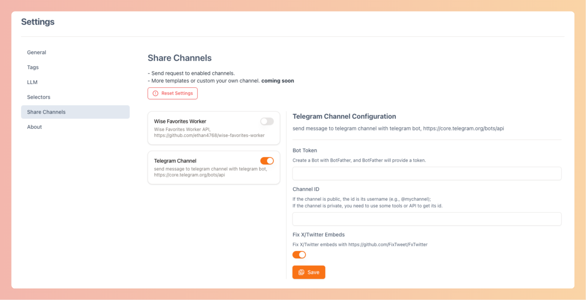
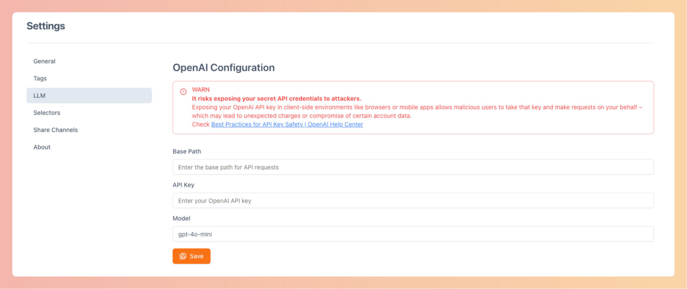

<h1 align="center">
  
  Wise Favorites Extension
</h1>

Effortlessly extract metadata, convert content to Markdown, customize with CSS selectors, share, and tag intelligently with AI.

  

More screenshots

**Side Panel**

**Popup**

**Share**

**Settings**

## Features

- 📄 **Metadata Extraction & Markdown Conversion**: Automatically extract page metadata and convert page content into
  Markdown format for easy readability and editing.

- 🎯 **Custom Selectors**: Specify custom CSS selectors to extract specific content according to your needs. See
  the [supported selectors](https://github.com/fb55/css-select/blob/master/README.md#supported-selectors) for more
  details.

- 🚀 **Seamless Sharing**: Effortlessly share extracted content to telegram channel
  or [wise-favorites-worker](https://github.com/ethan4768/wise-favorites-worker).

- 🤖 **AI-Enhanced Tagging**: Harness the power of OpenAI to intelligently tag content by selecting from a pre-set list
  of tags or generating new tags based on the content itself. You can manually modify these tags as needed, ensuring
  accurate and contextually relevant categorization.

- 📋 **Markdown Copy**: Quickly copy page titles and URLs in Markdown format to streamline documentation and note-taking.

## Installation

### Chrome Web Store
1. Visit the [Chrome Web Store](https://chromewebstore.google.com/detail/wise-favorites-extension/ngjobmgkopijgekhpfjfiicamlbeambk).
2. Click "Add to Chrome."

### Manual Installation

1. Download the extension's `.zip` file from **[latest available release](https://github.com/ethan4768/wise-favorites-extension/releases)**.
2. Unzip the file.
3. Open `chrome://extensions/` in your browser.
4. Enable "Developer mode" in the top right.
5. Click "Load unpacked" and select the unzipped folder.

## Acknowledgments

This extension is built utilizing the following open-source projects and libraries:

- **Framework & UI**:
    - [wxt-dev/wxt](https://github.com/wxt-dev/wxt): Utilized as the next-gen framework for optimizing extension
      development.
    - [shadcn/ui](https://ui.shadcn.com/) & [shadcn-ui-expansions](https://github.com/hsuanyi-chou/shadcn-ui-expansions):
      Provide the beautifully designed UI components to enhance user interaction.
    - [Tailwind CSS](https://tailwindcss.com/): Leveraged for rapid and efficient styling.
    - [Obsidian Web Clipper](https://obsidian.md/clipper): This extension draws on Obsidian Web Clipper's UI.

- **Content Parsing**:
    - [cheeriojs/cheerio](https://github.com/cheeriojs/cheerio): For parsing and manipulating HTML content.
    - [mozilla/readability](https://github.com/mozilla/readability): Utilized for extracting readable content from web
      pages.

- **Markdown Conversion**:
    - [unifiedjs/unified](https://github.com/unifiedjs/unified) & [rehypejs/rehype](https://github.com/rehypejs/rehype):
      Facilitate processing and transforming HTML to Markdown.
    - [rehypejs/rehype-remark](https://github.com/rehypejs/rehype-remark): Transforms HTML content into Markdown format
      for better integration with documentation tools.

- **AI & LLM**:
    - [openai/openai-node](https://github.com/openai/openai-node): Integrated for utilizing OpenAI's API to enhance
      tagging with AI-driven insights.

## License

MIT License
